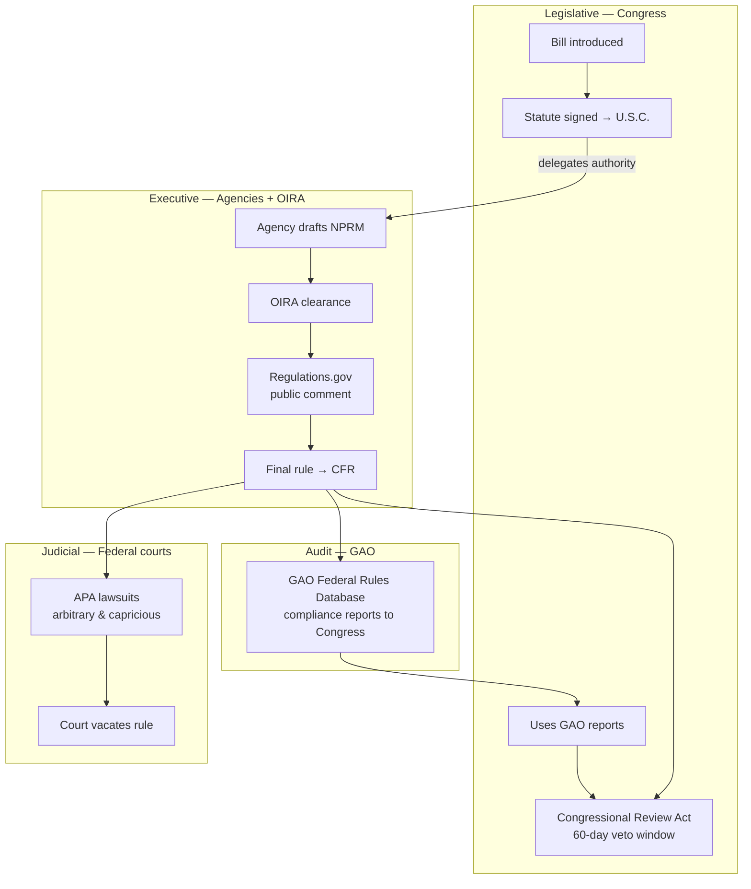

# Neptunus — Regulatory Intelligence Roadmap

> Distilled from [brainstorm.md](./brainstorm.md). Goal: help people effectively challenge federal rules — starting with better public comments, expanding into full regulatory intelligence across statutes, agency actions, audits, and courts.

**Current state:** [Public Comment Copilot](./README.md) — browse open NPRMs on Regulations.gov, summarize in plain English, draft substantive comments via LLM, optional direct submission. Integrates **Regulations.gov v4** + **Federal Register API** only. Stateless, no DB.

---

## 1. Domain model

### Laws vs rules (same chain, different lifecycles)

| | **Law (Statute)** | **Rule (Regulation)** |
|---|---|---|
| **Who writes it** | Congress | Federal agencies (EPA, FDA, etc.) |
| **Purpose** | Broad goals, grants authority | Technical, enforceable details |
| **Stored in** | United States Code (U.S.C.) | Code of Federal Regulations (CFR) |
| **Can exist alone?** | Yes | No — requires authorizing statute |

A law never "becomes" a rule. Think **parent → child**: the statute delegates authority; the agency writes the rule to implement it.

### Participating bodies



### Full rule lifecycle (where Neptunus can intervene)

| Phase | What happens | Bodies | Neptunus opportunity |
|---|---|---|---|
| **1. Statutory foundation** | Congress passes law, President signs | Congress, President | Link rule → parent U.S.C. section |
| **2. Pre-rule** | Agency studies issue, drafts proposal | Agency, OIRA | — (future: OIRA docket tracking) |
| **3. NPRM** | Proposed rule in Federal Register | Agency | **Current focus:** browse, summarize, draft comments |
| **4. Public comment** | Mandatory comment period on Regulations.gov | Agency, public | Comment quality, legal framing, precedent citations |
| **5. Final rule** | Published in FR + CFR | Agency | Track status; alert when comment period ends |
| **6A. CRA** | Congress can kill rule in ~60 legislative days | Congress | Auto-generate rep letters |
| **6B. GAO review** | Agency submits final rule to GAO | GAO → Congress | Surface audit flags in UI |
| **6C. Judicial review** | Lawsuits under APA | Federal courts | Precedent search, litigation tracker |
| **6D. Internal appeal** | Agency-specific boards (OPM, MSPB, etc.) | Agency | Domain-specific guides (later) |

### Key insight: "zombie rules"

A rule does **not** disappear when Congress passes a new law that strips agency authority. It remains in the CFR until repealed, vacated, or CRA-killed. Neptunus should detect **statutory conflicts** — e.g. "this NPRM cites Clean Air Act § X, but Public Law 118-XX last year removed that authority" — and surface them in comments.

---

## 2. Data sources & how to connect them

### Architecture: the Nexus

```
                    ┌──────────────────────────────┐
                    │   1. STATUTORY (Congress)    │
                    │   Congress.gov API           │
                    │   U.S. Code (USLM/XML)       │
                    └──────────────┬───────────────┘
                                   │ legal authority + amendments
                                   ▼
┌─────────────────────────┐  ┌───────────────┐  ┌──────────────────────────┐
│  2. ACTIVE REGULATION   │  │   NEPTUNUS    │  │  4. JUDICIAL / AUDIT     │
│  Regulations.gov API ◄──┼──│    ENGINE     ├──►  GAO Federal Rules DB     │
│  Federal Register API   │  │  (backend)    │  │  CourtListener / RECAP   │
└─────────────────────────┘  └───────┬───────┘  └──────────────────────────┘
                                     │
                                     ▼
                              ┌───────────────┐
                              │  Next.js UI   │
                              │  (wizard)     │
                              └───────────────┘
```

### Source catalog

| Source | API / access | What it provides | Link key |
|---|---|---|---|
| **Regulations.gov v4** | [open.gsa.gov/api/regulationsgov](https://open.gsa.gov/api/regulationsgov/) — `X-Api-Key` | Dockets, documents, comments, submission | `documentId`, `docketId`, `frDocNum` |
| **Federal Register API** | [federalregister.gov/developers](https://www.federalregister.gov/developers/documentation/api/v1) — keyless | Full NPRM text, citations, agencies | `frDocNum` (= FR document number) |
| **Congress.gov API** | [api.congress.gov](https://api.congress.gov/) — API key | Bills, laws, amendments, U.S. Code refs | `publicLawNumber`, U.S.C. title/section |
| **U.S. Code** | Congress.gov / USLM XML / GovInfo | Authorizing statutes, repeals | CFR "Authority" sections cite U.S.C. |
| **GAO Federal Rules Database** | [gao.gov/legal/federal-rules-database](https://www.gao.gov/legal/federal-rules-database) | Post-final compliance reports | Rule submission date, agency, FR citation |
| **CourtListener / RECAP** | [courtlistener.com/api](https://www.courtlistener.com/api/rest-info/) — API key | Federal opinions, dockets | Agency name, CFR cite, APA claims |
| **CFR (ecfr.gov)** | [ecfr.gov/developers](https://www.ecfr.gov/developers) | Final codified text | Title/part linked from FR final rules |

### Entity relationships (target data model)

```
Statute (U.S.C. §)
    │
    ├── authorizes ──► Agency
    │                      │
    │                      └── proposes ──► Docket (Regulations.gov)
    │                                            │
    │                                            ├── Document (NPRM / Final Rule)
    │                                            │       └── frDocNum ──► Federal Register doc
    │                                            │
    │                                            └── Comments (public)
    │
    ├── amended by ──► Public Law (Congress.gov)
    │
    └── challenged in ──► Court Case (CourtListener)
                              └── may cite ──► GAO Report
```

**Minimum viable link for Phase 1:** `Regulations.gov document` → parse "Authority" / statutory cites from Federal Register full text → resolve to `U.S.C. section` via Congress.gov or embedded FR citations.

---

## 3. Work items

### Tier 0 — Done (current codebase)

- [x] List proposed rules open for comment (`GET /rules`)
- [x] Fetch full rule text via Federal Register (`frDocNum`)
- [x] LLM summarize + interview questions (`POST /summarize`)
- [x] LLM draft comment with section citations (`POST /draft`)
- [x] Optional direct comment submission (`POST /submit`)
- [x] Wizard UI: browse → summary → draft → submit

### Tier 1 — Comment phase, smarter (Phase 1: "The Nexus")

Focus: keep comment UX as the entry point; enrich backend with one external link.

| # | Task | Data source | Notes |
|---|---|---|---|
| 1.1 | **Extract statutory authority** from FR preamble | Federal Register API | Parse "Authority", "Legal Authority", U.S.C. cites |
| 1.2 | **Resolve to Congress.gov** record | Congress.gov API | Store `{ uscTitle, uscSection, publicLaw? }` on rule |
| 1.3 | **Show parent law in UI** | — | "This rule is authorized by 42 U.S.C. § 7401 et seq." with link |
| 1.4 | **Docket content aggregator** | Regulations.gov API | Pull agency-specific questions from docket attachments / doc metadata |
| 1.5 | **Comment quality checklist** | Prompts only | Identity, stance, impact data, alternatives, statutory hook |
| 1.6 | **Track submitted comments** | Regulations.gov API | Let users save `commentId`, poll status/deadline changes |
| 1.7 | **Alert: comment deadline** | Regulations.gov | Email/push when tracked docket deadline moves |

**Backend changes:** add `statutory_authority` to `Rule` schema; new module `congress.py` or `statutory.py`; optional SQLite/Postgres for user watches (first DB).

### Tier 2 — Legal context (Phase 2: "The Legal Scanner")

| # | Task | Data source | Notes |
|---|---|---|---|
| 2.1 | **Court precedent search** | CourtListener API | Query by agency + CFR part + "arbitrary and capricious" |
| 2.2 | **Precedent-aware drafting** | CourtListener + LLM | Suggest: "In *Case X*, court struck down similar measurement method" |
| 2.3 | **GAO flag integration** | GAO Federal Rules Database | Cross-ref final rules; show "GAO flagged missing cost-benefit analysis" |
| 2.4 | **Legal lineage timeline** | All above | Visual: statute → past rules → current NPRM → active litigation |
| 2.5 | **Litigation tracker** | CourtListener | Active cases against same agency/rule family |

### Tier 3 — Policy monitor (Phase 3: "The Policy Monitor")

| # | Task | Data source | Notes |
|---|---|---|---|
| 3.1 | **Bill tracker** | Congress.gov API | Watch bills affecting tracked U.S.C. sections |
| 3.2 | **Statutory trigger alerts** | Congress.gov + rule graph | "New law PL 119-XX may invalidate Rule Y — update your comment" |
| 3.3 | **Zombie rule detector** | U.S. Code amendments vs CFR | Flag rules whose authority was repealed/amended |
| 3.4 | **CRA window tracker** | Federal Register + Congress.gov | After final rule: 60-day CRA countdown + letter generator |
| 3.5 | **Contact Congress pipeline** | Congress.gov (member lookup) | One-click CRA disapproval letter to rep |

### Tier 4 — Platform & UX

| # | Task | Notes |
|---|---|---|
| 4.1 | **Advanced search & alerts** | Filter NPRMs/RFIs by industry, keyword, agency |
| 4.2 | **Historical docket archive** | Regulations.gov + FR for closed dockets |
| 4.3 | **Legal archive UI** | Searchable past successful APA challenges |
| 4.4 | **Multi-phase wizard** | Extend wizard beyond comment: post-final pathways (CRA, APA, internal) |
| 4.5 | **Persistence layer** | User accounts, saved rules, comment history, alert prefs |

---

## 4. Comment drafting principles (product spec)

Comments are the **first line of appeal**. Agencies must consider substantive feedback. The drafter should enforce:

1. **Explicit identity & stance** — who, where, support/oppose
2. **Real-world impact** — financial/operational harm to commenter or community
3. **Data-driven alternatives** — one well-researched comment beats thousands of form letters
4. **Legal & statutory hooks** — authority limits, APA record-building for future litigation
5. **Precedent citations** (Tier 2+) — prior court rulings on similar agency actions

---

## 5. Post-final appeal pathways (informational, Tier 3+)

When comment phase fails and the rule is finalized:

| Path | Mechanism | Neptunus feature |
|---|---|---|
| **Congressional Review Act** | Joint resolution of disapproval within ~60 legislative days; blocks "substantially similar" future rules | CRA countdown + rep letter template |
| **APA lawsuit** | District court; "arbitrary, capricious," failure to respond to comments | Precedent library + "comments as litigation record" guidance |
| **Internal agency appeal** | OPM, MSPB, EPA ALJ, etc. | Domain-specific playbooks (later) |

---

## 6. Recommended build order

```
Now          Tier 1 (Nexus)        Tier 2 (Legal)       Tier 3 (Policy)
─────        ──────────────        ──────────────       ───────────────
Regulations  + Statutory link      + CourtListener      + Congress bill
+ FR APIs    + Authority UI        + GAO flags          + CRA tracker
+ LLM draft  + Comment checklist   + Timeline UI        + Zombie rule alerts
             + Docket aggregator   + Precedent drafts   + Alert system
             + Comment tracking
```

**Start Tier 1 with 1.1 + 1.3** — parse U.S.C. cites from Federal Register text and display parent law. No new API key required initially (FR text already fetched). Add Congress.gov when ready to validate links and detect amendments.

---

## 7. Open decisions

| Question | Options | Recommendation |
|---|---|---|
| Scope | Comment-only vs full pipeline | Full pipeline vision; ship incrementally via tiers |
| Persistence | Stay stateless vs add DB | Add lightweight DB at Tier 1.6 (comment tracking) |
| API keys needed next | Congress.gov, CourtListener | Congress.gov first (statutory link); CourtListener for Tier 2 |
| Auto-submit comments | Keep optional manual path | Keep human review + certification; submission is opt-in |
| Target regulations | Environmental, labor, financial, all | Start agency-agnostic; add vertical templates later |

---

## 8. API quick reference (for implementation)

| Integration | Base URL | Auth | Already in repo |
|---|---|---|---|
| Regulations.gov | `https://api.regulations.gov/v4` | `X-Api-Key` | `backend/regulations.py` |
| Federal Register | `https://www.federalregister.gov/api/v1` | None | `backend/federal_register.py` |
| Congress.gov | `https://api.congress.gov/v3` | `X-Api-Key` | — |
| CourtListener | `https://www.courtlistener.com/api/rest/v4` | Token | — |
| eCFR | `https://www.ecfr.gov/api/versioner/v1` | None | — |

---

## 9. Related files

| File | Role |
|---|---|
| [brainstorm.md](./brainstorm.md) | Raw LLM conversation (source material) |
| [README.md](./README.md) | Current app setup & architecture |
| [backend/regulations.py](./backend/regulations.py) | Regulations.gov client |
| [backend/federal_register.py](./backend/federal_register.py) | Federal Register client |
| [backend/prompts.py](./backend/prompts.py) | LLM prompts — extend for statutory/precedent context |
| [app/page.tsx](./app/page.tsx) | Wizard UI — extend for lineage/timeline views |

---

*This is not legal advice. Users should consult professionals for litigation or CRA strategy.*
